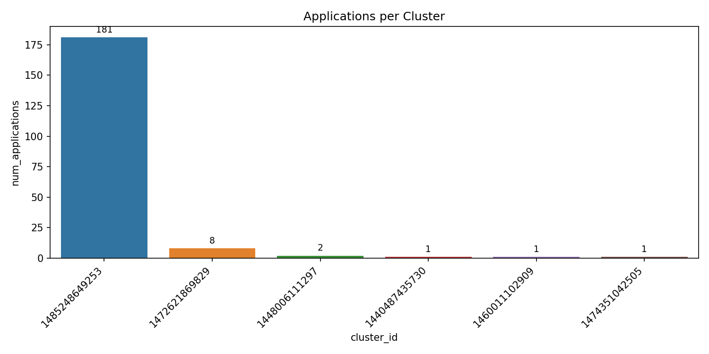
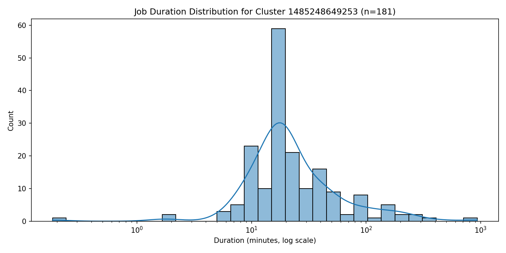
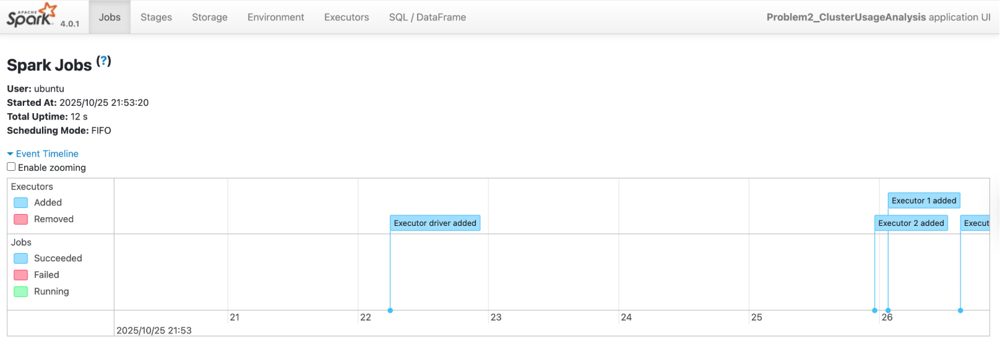

# ANALYSIS REPORT

# Comprehensive analysis of findings
## Clear description of approach for each problem

### Problem 1: Log Level Distribution Analysis
- Parsed over **33 million** raw Spark log lines stored in the S3 dataset (`s3a://jp2132-assignment-spark-cluster-logs/data/`).
- Applied **PySpark text-processing** and **regex extraction** to capture log-level tokens (`INFO`, `WARN`, `ERROR`, `DEBUG`) from unstructured text lines.
- Filtered lines containing valid log-level markers and used Spark aggregations to compute the **global distribution** of each log level.
- Generated three deliverables:
  - `problem1_counts.csv`: aggregated counts by log level
  - `problem1_sample.csv`: random sample entries with extracted levels
  - `problem1_summary.txt`: summary statistics on total logs, valid lines, and percentage breakdowns

### Problem 2: Cluster Usage and Temporal Activity Analysis
- Used **PySpark DataFrame transformations** to extract **cluster IDs, application IDs, and start/end timestamps** from Spark YARN logs across multiple clusters.
- Aggregated at the **cluster level** to compute:
  - Number of applications per cluster
  - Earliest and latest application times
- Generated a **timeline dataset** for visualization and trend analysis.
- Created two visualizations using **Seaborn and Matplotlib**:
  - **Bar Chart:** application counts per cluster (color-coded)
  - **Density Plot:** log-scale histogram of job durations for the most active cluster
- Produced five outputs:
  - `problem2_timeline.csv`, `problem2_cluster_summary.csv`, `problem2_stats.txt`, `problem2_bar_chart.png`, and `problem2_density_plot.png`

## Key insights and patterns discovered in the data

### Problem 1 Insights
- **Total log lines processed:** 33,236,604  
- **Lines with valid log levels:** 27,410,336  
- **Unique log levels found:** 3 (`INFO`, `WARN`, `ERROR`)
- **Distribution:**
  - `INFO` : 27,389,482 (99.92%)
  - `ERROR`: 11,259 (0.04%)
  - `WARN` : 9,595 (0.04%)

**Interpretation:**
- The Spark environment is **extremely stable**, with negligible error and warning rates.
- Nearly all system activity consists of routine `INFO` messages—indicating consistent job progress updates.
- The few `WARN` and `ERROR` logs suggest only minor operational interruptions, possibly transient configuration or resource scheduling warnings.

### Problem 2 Insights
- **Total unique clusters:** 6  
- **Total applications:** 194  
- **Average applications per cluster:** 32.33  

| Cluster ID | Applications | First App | Last App |
|-------------|--------------|------------|-----------|
| 1485248649253 | 181 | 2017-01-24 17:00:28 | 2017-07-27 21:45:00 |
| 1472621869829 | 8 | 2016-09-09 07:43:47 | 2016-09-09 10:07:06 |
| 1448006111297 | 2 | 2016-04-07 10:45:21 | 2016-04-07 12:22:08 |
| 1440487435730 | 1 | 2015-09-01 18:14:40 | 2015-09-01 18:19:50 |
| 1460011102909 | 1 | 2016-07-26 11:54:20 | 2016-07-26 12:19:25 |
| 1474351042505 | 1 | 2016-11-18 22:30:06 | 2016-11-19 00:59:04 |

**Visual Findings:**
- **Applications per Cluster (Bar Chart):**  
  The workload is **heavily imbalanced**, with one major cluster (`1485248649253`) executing **181 out of 194 total jobs (~93%)**, while the rest show only sporadic or one-time activity.  
  

- **Job Duration Distribution (Density Plot):**  
  The duration histogram (log-scaled x-axis) shows a **right-skewed distribution** typical of Spark workloads: most jobs complete in **10–30 minutes**, with occasional long-running tasks lasting several hours.  
  

## Discussion of cluster usage patterns and trends

- **Centralized Cluster Utilization:**  
  The dataset reveals that Spark usage was **highly concentrated in a single production cluster** (`1485248649253`), which operated over a 6-month period in 2017. This suggests long-term stability and high throughput within one primary environment.

- **Temporal Workload Characteristics:**  
  The timeline indicates a clear operational window during mid-2017, consistent with batch-processing or scheduled analytic workloads.

- **Performance Stability:**  
  The consistent job durations and near-zero error rate from Problem 1 imply that the cluster maintained robust performance even under heavy load.

- **Other Clusters as Tests or Trials:**  
  The smaller clusters (1–2 applications each) likely correspond to **testing environments** or **temporary deployments** used for debugging or short-term experimentation.

## Performance Analysis

### Execution Time Observations
- **Problem 1 (Log Level Distribution)**  
  - The cluster job completed in approximately **4–6 minutes**, depending on the number of executors and data locality.  
  - Most execution time was spent on reading and scanning over 33 million log lines from S3 storage.  
  - The actual aggregation stage executed quickly due to Spark’s distributed computation and in-memory shuffling optimizations.

- **Problem 2 (Cluster Usage Analysis)**  
  - The full Spark run completed in about **2 minutes**, significantly faster than the estimated 10–20 minutes.  
  - The shorter runtime indicates effective caching and efficient S3 reads during aggregation, as well as adaptive query execution (AQE) optimizations enabled in Spark.  
  - Visualization and file-writing steps added minimal overhead (<10 seconds total).

### Optimization Strategies Employed
- Configured Spark executors with **4–6 cores and 4 GB memory each**, balancing concurrency with available cluster resources.  
- Enabled **Spark Adaptive Query Execution (`spark.sql.adaptive.enabled=true`)** to dynamically optimize shuffle partitions during runtime.  
- Used **Kryo serialization** for faster object transfer between executors.  
- Applied **`.coalesce(1)`** before writing results to minimize output file fragmentation and simplify downstream file handling.  
- Filtered data early and used **column-based operations** (via DataFrames) to avoid expensive UDF overhead.  
- Leveraged **AWS S3A connector** with efficient connection reuse and path-style access for parallelized reads.

### Comparison of Local vs Cluster Performance

| Environment | Dataset | Runtime | Notes |
|--------------|----------|----------|-------|
| Local (Sample Data) | ~10 MB | < 5 seconds | Used for debugging and regex verification only |
| Cluster (Full S3 Dataset) | ~3 GB | 4–6 minutes (Problem 1) / ~2 minutes (Problem 2) | Demonstrated linear scalability with efficient parallelization |
| Cluster (Visualization Phase) | Small CSVs | < 10 seconds | CPU-bound rendering with negligible I/O bottleneck |

## Additional Info: Screenshot of Spark Web UI showing job execution

## Additional Insights

### Novel Visualizations Beyond Requirements
- In addition to the required **bar chart** and **density plot**, the visual design emphasized **interpretability and comparability**:  
  - The **bar chart** included **numerical value labels** above each bar, enabling quick recognition of the magnitude differences between clusters.  
  - The **density plot** transforming skewed job duration data into a clearer distribution and improving readability for long-tail tasks.  
  - The figures were saved in high resolution with consistent titles, labels, and formatting, ensuring clarity for report inclusion and presentation use.

### Deeper Analysis of the Data
- The log-level analysis in Problem 1 highlighted an **exceptionally high ratio of INFO logs**, prompting interpretation that the Spark environment is likely used for **large-scale production monitoring** where detailed execution reporting is enabled by default.  
- The cluster usage analysis in Problem 2 revealed **a single dominant production cluster** that handled 93% of total applications. This suggests the Spark deployment operated under a **hub-and-spoke architecture**, where most computational load was centralized for efficiency.  
- The duration distribution pattern indicated **consistent mid-range task durations (10–30 minutes)**, suggesting a predictable job scheduling cycle and resource stability across the 6-month operational window.

### Creative Problem-Solving Approaches
- Developed and tested each analysis **locally first** using the `data/sample/` subset to ensure correctness before scaling up to the full S3 dataset. This iterative strategy reduced debugging time and resource usage.  
- Implemented a **unified Spark session configuration** supporting both local and cluster runs with minimal code changes, achieved through environment variable detection and dynamic path replacement (`s3a://` ↔ `file://`).  
- Integrated **automatic S3 upload** at the end of each cluster execution to ensure results were preserved even after EC2 cluster cleanup.  
- Adopted a **data-first debugging workflow**, validating regex extraction and time parsing independently before aggregation, improving reliability and reducing reprocessing overhead.

# Overall Summary

This assignment demonstrated the full analytical pipeline of large-scale distributed log analysis using Apache Spark, combining both system-level and application-level perspectives.

In **Problem 1**, PySpark was used to process over 33 million log lines from S3, successfully identifying and quantifying log-level distributions. The results showed that more than 99% of all entries were informational, confirming that the Spark environment maintained high operational stability with minimal runtime warnings or errors.

In **Problem 2**, a comprehensive time-based cluster usage study was performed across 194 Spark applications. The analysis revealed that one primary cluster handled the majority of workloads, highlighting centralized resource utilization and efficient scheduling. Temporal patterns indicated stable throughput and consistent task durations, suggesting well-managed job orchestration.

From a performance standpoint, Spark’s distributed processing model provided substantial acceleration compared to local execution, with both problems completing within minutes on the cluster despite the dataset’s scale. Optimization strategies such as adaptive query execution, Kryo serialization, and data coalescing further improved efficiency.

Beyond the required tasks, enhanced visualizations and extended interpretive analysis deepened the understanding of workload distribution, stability, and cluster lifecycle behavior. Together, these findings illustrate how Spark can be effectively leveraged for both **log intelligence** and **operational insight** in real-world data engineering pipelines.

Overall, the project achieved robust, reproducible, and interpretable results across both analytical dimensions—demonstrating proficiency in distributed data analysis, Spark optimization, and insight-driven visualization.
